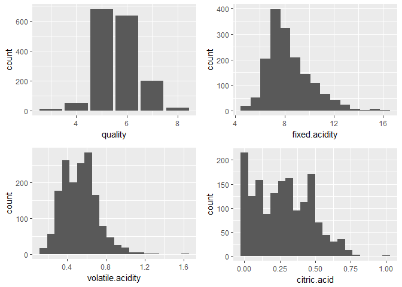
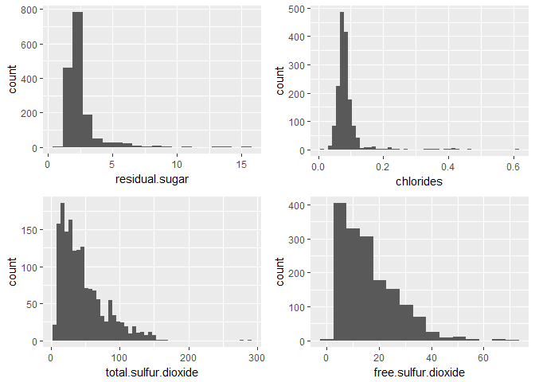
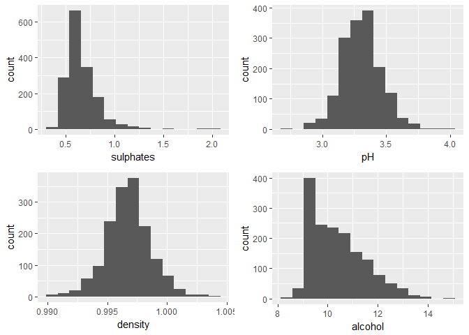
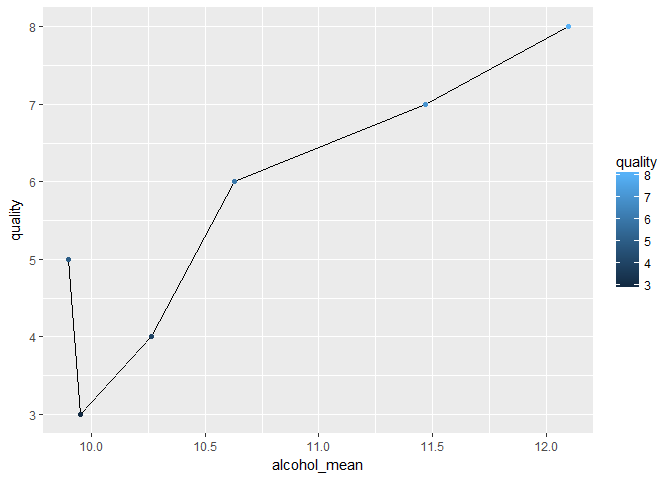
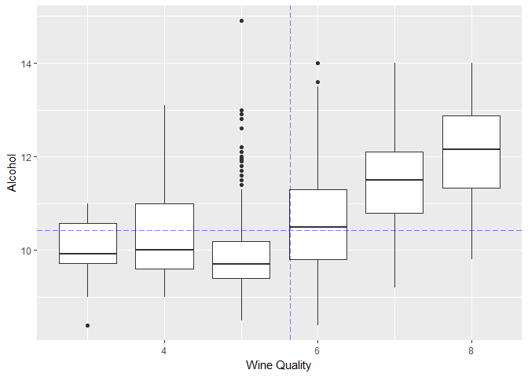
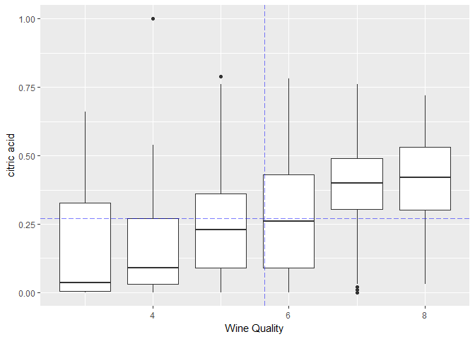
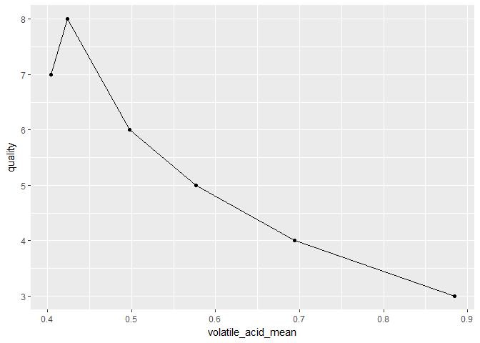
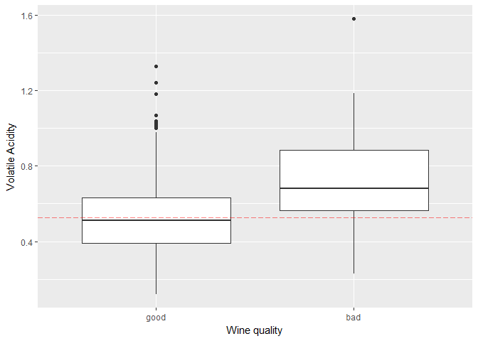
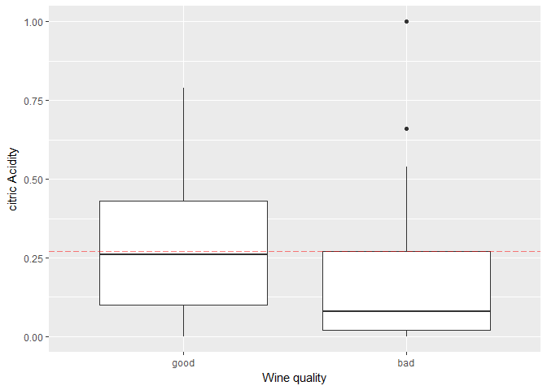

Red wine analysis
-----------------

first let's read the data and load some usfull libiraries

    Mydata=read.csv("C:/Users/ahmed/Downloads/wineQualityReds.csv")
    library('ggplot2')
    library('ggthemes')
    library('gridExtra')
    library('dplyr')

    ## 
    ## Attaching package: 'dplyr'

    ## The following object is masked from 'package:gridExtra':
    ## 
    ##     combine

    ## The following objects are masked from 'package:stats':
    ## 
    ##     filter, lag

    ## The following objects are masked from 'package:base':
    ## 
    ##     intersect, setdiff, setequal, union

    library('psych')

    ## 
    ## Attaching package: 'psych'

    ## The following objects are masked from 'package:ggplot2':
    ## 
    ##     %+%, alpha

ok, after that first thing i love to do is to look at the distribution
of every variable

    d1<-ggplot(data = Mydata,aes(quality))+geom_bar()
    d2<-ggplot(data = Mydata,aes(fixed.acidity))+geom_histogram(bins = 15)
    d3<-ggplot(data = Mydata,aes(volatile.acidity))+geom_histogram(bins = 20)
    d4<-ggplot(data = Mydata,aes(citric.acid))+geom_histogram(bins = 20)
    grid.arrange(d1,d2,d3,d4)

    d5<-ggplot(data = Mydata,aes(residual.sugar))+geom_histogram(bins = 20)
    d6<-ggplot(data = Mydata,aes(chlorides))+geom_histogram(bins = 50)
    d7<-ggplot(data = Mydata,aes(total.sulfur.dioxide))+geom_histogram(bins = 50)
    d8<-ggplot(data = Mydata,aes(free.sulfur.dioxide))+geom_histogram(bins = 15)
    grid.arrange(d5,d6,d7,d8)

    d9<-ggplot(data = Mydata,aes(sulphates))+geom_histogram(bins = 15)
    d10<-ggplot(data = Mydata,aes(pH))+geom_histogram(bins = 15)
    d11<-ggplot(data = Mydata,aes(density))+geom_histogram(bins = 15)
    d12<-ggplot(data = Mydata,aes(alcohol))+geom_histogram(bins = 15)
    grid.arrange(d9,d10,d11,d12)

*Quality has most values concentrated in the categories 5, 6 and 7. Only
a small proportion is in the categories \[3, 4\] and \[8, 9\] and none
in the categories \[1, 2\] and 10. *Residual sugar has a positively
skewed distribution. \*Alcohol has an irregular shaped distribution.
let's use some descriptive statistics that might help.

    quality_min <- min(Mydata$quality)
    quality_max <- max(Mydata$quality)
    quality_mean <- mean(Mydata$quality)
    quality_median <- median(Mydata$quality)

We can see that, although the range of posible scores is from 0 to 10,
in our dataset the minimum score is 3 and the maximum is 8. The mean is
5.6360225 and the median is 6, very close to each other.

What about the dispersion around the mean?

    reds_quality_sd <- sd(Mydata$quality)

With a standard deviation of 0.8075694, our distribution of quality
scores is not very disperse.

Let have a look at how correlated our different variables are.

    cor(x=Mydata[,2:12], y=Mydata$quality)

    ##                             [,1]
    ## fixed.acidity         0.12405165
    ## volatile.acidity     -0.39055778
    ## citric.acid           0.22637251
    ## residual.sugar        0.01373164
    ## chlorides            -0.12890656
    ## free.sulfur.dioxide  -0.05065606
    ## total.sulfur.dioxide -0.18510029
    ## density              -0.17491923
    ## pH                   -0.05773139
    ## sulphates             0.25139708
    ## alcohol               0.47616632

we see here that some variables have high correlated values like
*Alcohol (+++) *Volatile acidity (—) \*Citric acid (++) I will
concentrate in the this three variables that show stronger correlation
with quality. First of all, a summary of the differnet mean values.

    data_quality<-group_by(Mydata,quality)
    Mydata.quality_means<-summarise(data_quality,fixed_acid_mean=mean(fixed.acidity),
              volatile_acid_mean=mean(volatile.acidity),
              citric_acid_mean=mean(citric.acid),
              sugar_mean=mean(residual.sugar),
              salt_mean=mean(chlorides),
              sulfur_mean=mean(total.sulfur.dioxide),
              sulphates_mean=mean(sulphates),
              density_mean=mean(density),
              alcohol_mean=mean(alcohol)
              )
    summary(Mydata$alcohol)

    ##    Min. 1st Qu.  Median    Mean 3rd Qu.    Max. 
    ##    8.40    9.50   10.20   10.42   11.10   14.90

    alcohol_mean <- mean(Mydata$alcohol)
    alcohol_median <- median(Mydata$alcohol)
    Mydata.quality_means[,c('quality','alcohol_mean')]

    ## # A tibble: 6 x 2
    ##   quality alcohol_mean
    ##     <int>        <dbl>
    ## 1       3     9.955000
    ## 2       4    10.265094
    ## 3       5     9.899706
    ## 4       6    10.629519
    ## 5       7    11.465913
    ## 6       8    12.094444

#### Alcohol

let's visualize how the alcohol mean affect wine quality

    ggplot(aes(x=alcohol_mean,y=quality),data = Mydata.quality_means)+geom_line()+geom_point(aes(color=quality))

 from
this two plots we can see that with more alcohol level the wine quality
increase lets also see alcohol by quality level, together with the
median for the whole distribution and the mean for the quality scores.

    ggplot(data=Mydata, aes(x=quality, y=alcohol)) +
      geom_boxplot(aes(group=cut_width(quality,1))) +
      geom_hline(show.legend =T, yintercept=alcohol_mean, linetype='longdash', alpha=.5, color='blue') +
      geom_vline(xintercept =quality_mean, linetype='longdash', color='blue', alpha=.5) +
      xlab("Wine Quality") +
      ylab("Alcohol")

 We can
see how wine scores that are beyond the mean quality value of 5.6360225,
also tend to show values beyond the mean alcohol value of 10.4229831
there is some tendency.

#### Citric acid

let’s perform a similar analysis for citric acid

    summary(Mydata$citric.acid)

    ##    Min. 1st Qu.  Median    Mean 3rd Qu.    Max. 
    ##   0.000   0.090   0.260   0.271   0.420   1.000

    citric.acid_mean <- mean(Mydata$citric.acid)
    citric.acid_median <- median(Mydata$citric.acid)
    Mydata.quality_means[,c('quality','citric_acid_mean')]

    ## # A tibble: 6 x 2
    ##   quality citric_acid_mean
    ##     <int>            <dbl>
    ## 1       3        0.1710000
    ## 2       4        0.1741509
    ## 3       5        0.2436858
    ## 4       6        0.2738245
    ## 5       7        0.3751759
    ## 6       8        0.3911111

The mean value for the citric acid is 0.2709756 with a standard
deviation of 0.1948011. As a note, the maximum value for citric acid is
1. That is 3.7424031 standard deviations beyond the mean!probably an
outlier.

    ggplot(aes(x=citric_acid_mean,y=quality),data = Mydata.quality_means)+geom_line()+geom_point(aes(color=quality))

    ggplot(data=Mydata, aes(x=quality, y=citric.acid)) +
      geom_boxplot(aes(group=cut_width(quality,1))) +
      geom_hline(show.legend =T, yintercept=citric.acid_mean, linetype='longdash', alpha=.5, color='blue') +
      geom_vline(xintercept =quality_mean, linetype='longdash', color='blue', alpha=.5) +
      xlab("Wine Quality") +
      ylab("citric acid")

we can see here that the more citric acid the more good wine.

#### volatile acidity

lets make same summarize for volatile acidity but i will explore it in
diffirent way since this variable have negativ correlation fro quality
so i will categorize wines &lt;5 as bad and &gt;5 as good and see levels
of volatile acidity for each category.

    summary(Mydata$volatile.acidity)

    ##    Min. 1st Qu.  Median    Mean 3rd Qu.    Max. 
    ##  0.1200  0.3900  0.5200  0.5278  0.6400  1.5800

    volatile.acidity_mean <- mean(Mydata$volatile.acidity)
    volatile.acidity_median <- median(Mydata$volatile.acidity)
    Mydata.quality_means[,c('quality','volatile_acid_mean')]

    ## # A tibble: 6 x 2
    ##   quality volatile_acid_mean
    ##     <int>              <dbl>
    ## 1       3          0.8845000
    ## 2       4          0.6939623
    ## 3       5          0.5770411
    ## 4       6          0.4974843
    ## 5       7          0.4039196
    ## 6       8          0.4233333

    Mydata <- transform(Mydata, is.bad = quality<5)
    bad.reds <- table(Mydata$is.bad)
    bad.reds

    ## 
    ## FALSE  TRUE 
    ##  1536    63

now lets visualize it

    ggplot(aes(x=volatile_acid_mean,y=quality),data = Mydata.quality_means)+geom_line()+geom_point()

    ggplot(data=Mydata, aes(x=is.bad, y=volatile.acidity)) +
      geom_boxplot() +
      geom_hline(show.legend =T, yintercept=volatile.acidity_mean, linetype='longdash', alpha=.5, color='red')+
      scale_x_discrete(labels=c('good','bad'))+
      xlab("Wine quality") +
      ylab("Volatile Acidity")

actually let's see same plot for the three variables with high corr
value

    ggplot(data=Mydata, aes(x=is.bad, y=citric.acid)) +
      geom_boxplot() +
      geom_hline(show.legend =T, yintercept=citric.acid_mean, linetype='longdash', alpha=.5, color='red')+
      scale_x_discrete(labels=c('good','bad'))+
      xlab("Wine quality") +
      ylab("citric Acidity")

    ggplot(data=Mydata, aes(x=is.bad, y=alcohol)) +
      geom_boxplot() +
      geom_hline(show.legend =T, yintercept=alcohol_mean, linetype='longdash', alpha=.5, color='red')+
      scale_x_discrete(labels=c('good','bad'))+
      xlab("Wine quality") +
      ylab("alcohol")

in case of alcohol it seems that it dosn't affect the bad wines but with
citric acid we see that at certain level of the acid the wine quality
increase.

summary&reflection
------------------

About good wines. It seems clear that they have certain levels of
alcohol and citric acid, and lack of defects. We already saw charts and
distribution in previous sections showing a positive correlation between
these variable and quality. What about defects? We already saw thet
volatile acidity is very determinant for faulty wines. We also saw that
alcohol is not. Both faulty and correct wines have similar distributions
of levels of alcohol. And we finally saw that a high level of citric
acid is associated with less faulty wines.
